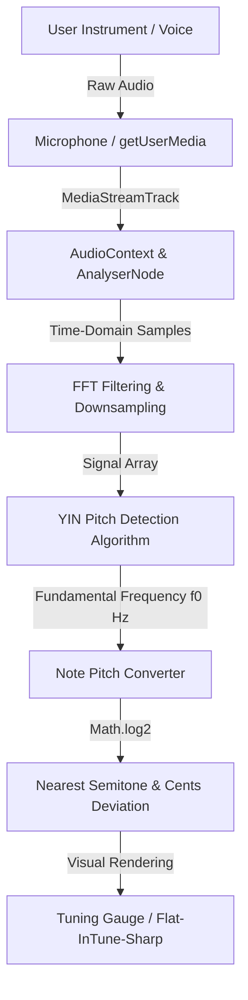

# MeloFY 🎶

> The Premium, All-in-One Web Application & PWA for Modern Musicians.

MeloFY combines a interactive chord dictionary, a sample-accurate metronome, a high-fidelity chromatic tuner, and a personal practice dashboard into a cohesive, responsive, and tactile interface.

### 🌐 Live Deployment
Check out the live application here: **[https://melofyyy.vercel.app/](https://melofyyy.vercel.app/)**

---

## ✨ Features Overview

- **🎸 Interactive Chord Library:** Look up any chord formula (e.g., `Cmaj7`, `F#m7`, `Dsus4`) to view vector guitar fingering diagrams and piano keyboard highlights. Features realistic synthesised audio playbacks for both instruments.
- **⏱️ Web Audio Metronome:** A sample-accurate metronome running on the Web Audio API scheduler thread to prevent lag. Supports custom BPM, multiple subdivisions, and distinct time signatures (4/4, 3/4, 6/8, etc.).
- **🎤 Chromatic Guitar Tuner:** A real-time pitch detector using high-precision digital signal processing (DSP) to tune standard and alternative instrument setups.
- **📊 Personal Dashboard:** Track search history, save chords, and print/export a beautifully formatted PDF chord sheet complete with vector diagram guides.

---

## 🔬 Chromatic Tuner: Under the Hood

The MeloFY Tuner is built using modern browser APIs and digital audio algorithms. Here is a technical breakdown of how it captures, processes, and evaluates your instrument's pitch in real-time.



### 1. Microphone Input (`getUserMedia`)
To process live audio, MeloFY first requests permission to capture the user's microphone. It requests a clean, un-equalized mono channel:
```typescript
const stream = await navigator.mediaDevices.getUserMedia({
  audio: {
    echoCancellation: false,
    noiseSuppression: false,
    autoGainControl: false
  }
});
```
*Disabling built-in browser echo cancellation and noise suppression is crucial because these filters treat sustained string vibrations as background noise and compress them, which disrupts pitch analysis.*

### 2. Audio Processing Graph & Analyser Node
The microphone stream is routed through the browser's **Web Audio API** pipeline. The stream is connected to an `AudioContext` which acts as the audio processing environment, feeding into an `AnalyserNode` to extract real-time audio information:
```typescript
const audioCtx = new (window.AudioContext || (window as any).webkitAudioContext)();
const source = audioCtx.createMediaStreamSource(stream);
const analyser = audioCtx.createAnalyser();
analyser.fftSize = 2048; // Size of window for Fast Fourier Transform
source.connect(analyser);
```

### 3. Fast Fourier Transform (FFT) Analysis
MeloFY extracts raw audio samples from the buffer using `getFloat32TimeDomainData`. These samples represent the amplitude of the sound wave over time. The **FFT (Fast Fourier Transform)** converts these time-domain values into frequency-domain data to identify which frequencies are active.
- A buffer size (`fftSize`) of `2048` at a standard `44.1 kHz` sampling rate provides a frequency resolution of:
  $$\text{Resolution} = \frac{44100 \text{ Hz}}{2048} \approx 21.5 \text{ Hz}$$
- Because a resolution of $21.5\text{ Hz}$ is too coarse to identify small differences in pitch (e.g., the difference between $E_2$ at $82.41\text{ Hz}$ and $F_2$ at $87.31\text{ Hz}$ is only $4.9\text{ Hz}$), MeloFY uses a specialized time-domain frequency estimation algorithm.

### 4. The YIN Pitch Detection Algorithm
While standard FFT is excellent for visualization, it lacks the precision required for tuning. MeloFY utilizes the **YIN Pitch Detection Algorithm** (developed by de Cheveigné and Kawahara) to isolate the fundamental frequency ($f_0$) from background harmonics.

The YIN algorithm calculates pitch in five distinct steps:
1. **Autocorrelation:** Compares the signal with a copy of itself shifted by a time delay ($\tau$, or lag).
2. **Difference Function:** Quantifies the difference between the original signal and the shifted signal:
   $$d_t(\tau) = \sum_{j=1}^{W} (x_j - x_{j+\tau})^2$$
3. **Cumulative Mean Normalized Difference Function:** Normalizes the difference to prevent the algorithm from incorrectly identifying harmonics (like octave multipliers) as the fundamental pitch.
4. **Absolute Thresholding:** Finds the smallest delay ($\tau$) where the difference drops below a strict threshold (typically $0.1$ to $0.15$). This first local minimum corresponds to the true period of the fundamental wave.
5. **Parabolic Interpolation:** Fits a parabola around the minimum to estimate the exact pitch frequency with sub-sample precision.
$$\text{Frequency (Hz)} = \frac{\text{Sample Rate}}{\text{Interpolated Period } \tau}$$

**Example:**
- If you pluck the A string on a guitar ($110.00\text{ Hz}$), the YIN algorithm detects a period of approximately $\tau \approx 400.9$ samples (at $44.1\text{ kHz}$).
- Parabolic interpolation refines this to $\tau = 400.909$ samples.
- The detected frequency is calculated as:
  $$f_0 = \frac{44100}{400.909} = 110.00 \text{ Hz} \text{ (Perfectly in Tune!)}$$

### 5. Semitone Conversion & Cent Deviation
Once the fundamental frequency ($f_0$) is resolved in Hz, MeloFY converts the value into a musical note. It uses the logarithmic MIDI scale (where $A_4 = 440\text{ Hz}$ corresponds to MIDI note 69):
$$\text{MIDI Note} = 12 \times \log_2\left(\frac{f_0}{440}\right) + 69$$

**Example calculation for a detuned string ($f_0 = 198.00\text{ Hz}$):**
1. Convert to MIDI value:
   $$\text{MIDI} = 12 \times \log_2\left(\frac{198.00}{440}\right) + 69 \approx 55.176$$
2. The nearest integer is **55**, which corresponds to note **G3** ($196.00\text{ Hz}$).
3. The decimal portion represents the **cent deviation** (1 cent is $1/100$th of a semitone):
   $$\text{Deviation} = (55.176 - 55) \times 100 = +17.6 \text{ cents}$$
4. MeloFY highlights note **G** and moves the gauge needle to $+18$ cents, indicating the string is **Sharp**.

### 6. Tuning Presets Supported
MeloFY supports a wide range of presets to adapt to alternative tuning configurations:

| Preset Name | String 6 | String 5 | String 4 | String 3 | String 2 | String 1 | Notes / Use Cases |
| :--- | :---: | :---: | :---: | :---: | :---: | :---: | :--- |
| **Standard** | E2 | A2 | D3 | G3 | B3 | E4 | Default tuning |
| **Drop D** | **D2** | A2 | D3 | G3 | B3 | E4 | Popular in Rock & Metal for heavy riffs |
| **DADGAD** | **D2** | A2 | D3 | G3 | **A3** | **D4** | Traditional Celtic & ambient acoustic music |
| **Open G** | **D2** | **G2** | D3 | G3 | B3 | **D4** | Great for slide guitar and blues |

---

## 🛠️ Local Development Setup

To run MeloFY locally on your machine, follow these instructions:

### Prerequisites
- Node.js (v18.0.0 or higher)
- npm or bun

### 1. Installation
Clone the repository and install all dependencies:
```bash
npm install
```

### 2. Development Server
Start the local Vite server:
```bash
npm run dev
```
Open [http://localhost:3000](http://localhost:3000) in your web browser.

### 3. Build & Production Verification
To compile the client files and server SSR environment locally:
```bash
npm run build
```
Preview the production build:
```bash
npm run preview
```

### 4. Formatting & Code Style
To ensure code files comply with Prettier styling:
```bash
npm run format
```

---

## 📦 Deployment Configuration (Vercel Integration)
MeloFY is built on **TanStack Start** with a **Nitro** server engine. To host it correctly on Vercel without routing 404 errors, specify the vercel build target in the configuration:
```typescript
// vite.config.ts
import { defineConfig } from "@lovable.dev/vite-tanstack-config";

export default defineConfig({
  tanstackStart: {
    server: { entry: "server" },
  },
  nitro: {
    preset: "vercel", // Generates .vercel/output for correct serverless routing
  },
});
```

---

*Made with 💖 for musicians who play.*
